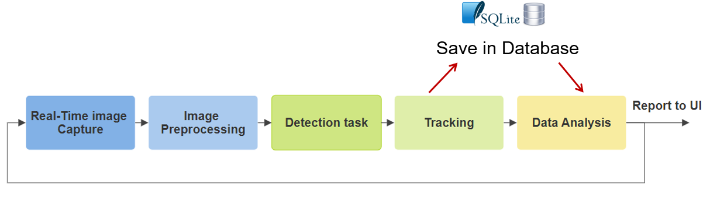

# Parking Lot Occupancy Analysis System

## Project Description

This repository contains the source code for a parking lot occupancy analysis system developed as a university project. 
The system utilizes object detection to analyze the occupancy of a bicycle and motorcycle parking lot in front of the university campus. It runs on a Raspberry Pi equipped with a camera, capturing images of the parking lot. The captured images undergo preprocessing, object detection using YOLOv5n6 model trained on a custom dataset, tracking of detected objects, and storage of occupancy data in a local database. 

Additionally, a graphical user interface (GUI) is provided for visualizing the derived results of the main analysis. The GUI, implemented in the `GUI` folder, includes a `gui.py` file that queries the database, performs a simple data analysis of occupancy, and displays the results on a local UI. The project aims to provide a practical solution for monitoring parking lot usage and analyzing occupancy patterns.

The structure of the system code base is shown in the following figure.


**Figure 1. Parking Lot Analysis Pipeline**

## Features

- Object detection using YOLOv5n6 model trained on a custom dataset for detecting bicycles and motorcycles.
- Tracking system implemented to assign detections to corresponding parking spots and track occupancy.
- Continuous analysis of parking lot occupancy with data saved in a local database (SQlite).
- Graphical user interface (GUI) for visualizing analysis results (Tkinter).

## Installation Instructions

### Raspberry Pi Setup

1. **Prepare Raspberry Pi:**
   - Ensure your Raspberry Pi is set up and connected to the internet.
   - Connect and enable the camera module in the Raspberry Pi configuration settings.

2. **Install Operating System:**
   - Install Raspberry Pi OS (formerly Raspbian) on your Raspberry Pi if not already installed.

3. **Enable Camera Module:**
   - Enable the camera module in the Raspberry Pi configuration settings.

### Dependencies Installation

1. **Clone Repository:**
   - Clone this repository to your Raspberry Pi:
     ```
     git clone https://github.com/sebasmej/Parkinglot_usage_analyse.git
     ```

2. **Install Python Dependencies:**
   - Navigate to the project directory:
     ```
     cd your-repository-name/data
     ```
   - Install required Python dependencies:
     ```
     pip install -r requirements.txt
     ```

## Running the Program

To run the program, execute the `main.py` script with optional command-line arguments:

- **-map \<path>**: Path to a .txt file containing the mapped layout of the parking lot. A mapped parking lot file already exists and is used by default. If the camera position is changed it is necessary to modify this map file.
  
- **-model \<path>**: Path to the YOLO model file for object detection. Default: yolov5n6.

- **-conf \<value>**: Confidence threshold for the detection task, ranging from 0 to 1. Default: 0.05.

- **-iou \<value>**: IoU threshold for Non-Maximum Suppression (NMS). Default: 0.3.

- **-n \<value>**: Length of the detection record, influencing the frame capture frequency (`f`). Default: 2.

The program runs continuously, repeating the process of taking photos, preprocessing, object detection, tracking, and saving the results in the database. You can set these arguments directly in the code or provide them when running the script.

## Using the GUI Interface

To visualize the data collected and analyzed by the main program, use the `gui.py` script. This script queries the database every 15 minutes, performs a data analysis of occupancy, and displays the information in a local UI.

To run the GUI script, execute `gui.py` with the following optional command-line argument:

- **-database \<path>**: Path to the database file (`.db`). Default: the local database created by the main program.

## Aditional Information

### Pre-trained Models

- Pre-trained models for object detection are located in the `models` directory.
- The default model (YOLOv5n6) is automatically selected for detection.

### Database Setup

- The system uses a local database stored on the Raspberry Pi.
- If the database doesn't exist, it will be automatically created.

### Detection Record Configuration

- The detection record configuration (`n`) impacts the frame capture frequency (`f`). 
- The frame capture frequency (`f`) is calculated based on the chosen detection record (`n`). For example, if `n = 2`, then `f = 15` minutes. Below is a table showing the available configurations:

 Detection Record (n) | Frame Capture Frequency (f) |
|-----------------------|------------------------------|
| 2                     | 15     minutes               |
| 3                     | 7.5    minutes               |
| 4                     | 5      minutes               |
| 5                     | 3.75   minutes               |
| 6                     | 3      minutes               |
| 7                     | 2.5    minutes               |
| 8                     | 2.2    minutes               |
| n                     | f = 15 minutes / (n-1)       |

- Adjust the detection record (`n`) based on your requirements to optimize the system's performance.

### Project Documentation

- [Part 1: Model Selection and Training](TEL21GR3_Mejia_Sebastian_DokutT3100_ObjectDetectionParkingSpaceAnalysis.pdf)
This document outlines the process of selecting object models, curating the training dataset, training the models, and evaluating their performance based on the training results.

- [Part 2: Evaluation and Parameter Analysis](TEL21GR3_Sebastian_Mejia_DokutT3200_ObjectDetectionParkingSpaceAnalysis.pdf)
In this document, the selected models are evaluated using a real dataset extracted from the parking lot and manually labeled. The document also includes an analysis of object detection parameters, such as confidence threshold and IoU for non-maximum suppression. Additionally, it provides detailed insights into the codebase, explaining the functionality of each module and outlining future improvements for the project.

## Mapping the Parking Lot

- Mapping the parking lot allows the system to accurately detect and track vehicles in the parking lot. By defining bounding boxes over each parking spot and associating them with unique identifiers, the system can precisely determine the occupancy status of each spot.
- Mapping the parking lot manually is necessary when the camera's position changes, as it ensures accurate detection and tracking of vehicles in the new camera position.
- By using the provided mapping tool, users can define bounding boxes over each parking spot, associating them with unique identifiers.
- Additionally, while the current tool requires manual input, it serves as a foundation for further development towards automation, allowing for more efficient mapping of parking lots in the future.

### How to Use the Mapping Tool:
1.  Navigate to the `src/utils` folder.
2.  Open the `map_parking_lot.py` script.
3.  Replace the line below in the code, with the actual path to the photo of the parking lot:
    ```sh
    img = cv2.imread('your-image-path')
   
4.  Run the skript:
    ```sh
    python map_parking_lot.py
5.  The script will open the photo of the parking lot.
6.  Click and drag bounding boxes with a fixed width and height to cover each parking spot. The Bbox width and height can be modified in the code as desired.
7.  Release the click to place the bounding box. The coordinates of the bounding box will automatically be printed in the console.
8.  Once all parking spots are mapped, copy the coordinates from the console.
9.  Create a text file (e.g., parking_lot_map.txt) and paste the coordinates into it.
10. Add an alphanumeric identifier to each set of coordinates. The identifier format is already defined and shown below.
 
Example of mapped parking spot coordinates in the text file:

```sh
A1 0.0854166666666667 0.413888888888889 0.0260416666666667 0.0462962962962963
A2 0.0854166666666667 0.413888888888889 0.0260416666666667 0.0462962962962963
                                  ...
B1 0.1854166666666667 0.313888888888889 0.1260416666666667 0.1462962962962963
                                  ...
